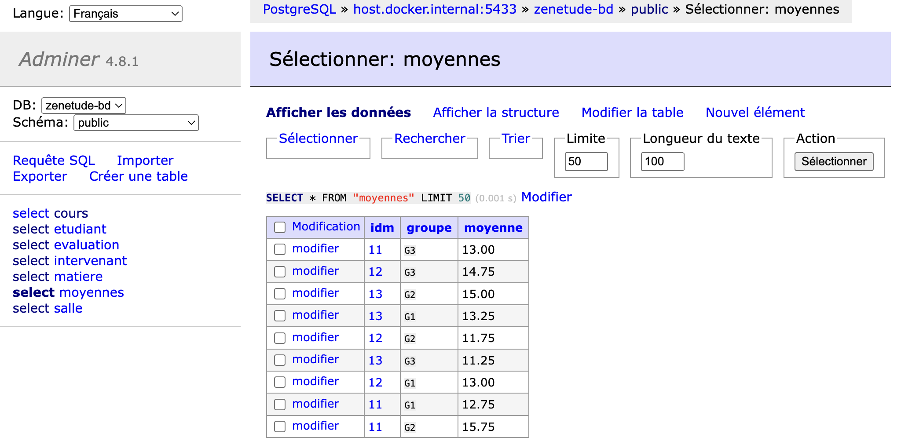

# SQL TD LEVEL "NOOB"

[TD1-1](https://mickael-martin-nevot.com/institut-g4/sql/?:s40-td1-1-schema-relationnel.pdf)
[TD1-1 SQL File](https://mickael-martin-nevot.com/institut-g4/sql/s40-td1-1-schema-relationnel-extension.sql)
[TD1-2](https://mickael-martin-nevot.com/institut-g4/sql/?:s40-td1-2-integrite-et-langage-de-definition-de-donnees-ldd.pdf)

Create a postgres container
```bash
docker run --name td-sql-nevot \
  -e POSTGRES_USER=postgres \
  -e POSTGRES_PASSWORD=123 \
  -e POSTGRES_DB=zenetude-bd \
  -p 5433:5432 \
  -d postgres
```

Access the container, access to Postgres, and use the database
```bash
docker exec -it td-sql-nevot bash
psql -U postgres -d zenetude-bd
```

Create tables and insert data with `create-tables.sql` and `insert-data.sql`

Create a adminer container
```bash
docker run -d --name adminer -p 8080:8080 adminer
```

Access the adminer in the browser

```url
http://localhost:8080/?pgsql=host.docker.internal%3A5433&username=postgres&db=zenetude-bd&ns=public&select=moyennes
```

Password is `123`

Expected result:


Stop and remove the containers
```bash
docker stop td-sql-nevot adminer
docker rm td-sql-nevot adminer
```